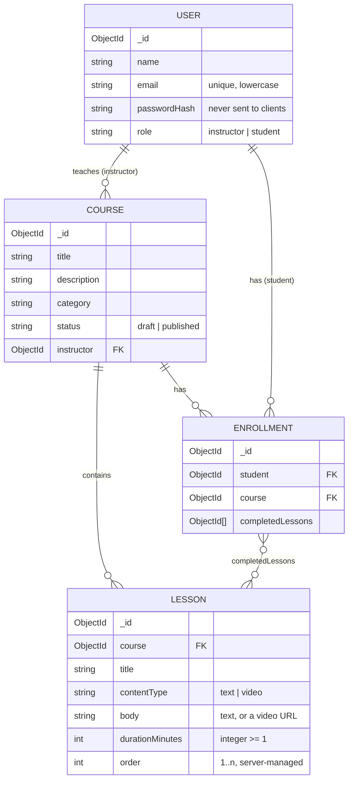

# Micro-LMS

A small learning management system. Instructors create courses made of ordered lessons; students enroll, work through lessons and track their progress.

- **server/**: Express 5 + Mongoose 9 REST API, JWT auth (bcryptjs for password hashing)
- **client/**: Vite 6 + React 19 + React Router 7 + Tailwind CSS 4

## Setup (under 5 minutes)

**You need:** Node.js 18 or newer, and MongoDB (a local `mongod` or a free Atlas cluster). The client pins Vite 6 rather than 7, so older Node 22 releases like 22.2 work as well.

```bash
# 1. Install dependencies for root, server and client in one go
npm run install:all

# 2. Configure the API
cp server/.env.example server/.env    # then edit if needed

# 3. Load demo data (this wipes the collections first)
npm run seed

# 4. Start API + client together
npm run dev
```

Then open **http://localhost:5173**. The API runs on http://localhost:5000 (`GET /api/health` returns `{ ok: true }`).

### Environment variables (`server/.env`)

| Variable | Example | Purpose |
|---|---|---|
| `MONGO_URI` | `mongodb://127.0.0.1:27017/micro-lms` | MongoDB connection string. Paste your Atlas `mongodb+srv://...` URI here if you use Atlas. |
| `JWT_SECRET` | any long random string | Secret used to sign the login tokens. |
| `PORT` | `5000` | Port the API listens on. |
| `CLIENT_ORIGIN` | `http://localhost:5173` | Frontend origin allowed by CORS. |

### Seeded accounts

Every account uses the password **`password123`**.

| Role | Email | Notes |
|---|---|---|
| Instructor | alice.instructor@example.com | Owns JavaScript Fundamentals, Intro to MongoDB, and the draft Advanced Node.js |
| Instructor | bob.instructor@example.com | Owns UI Design Basics |
| Student | sam.student@example.com | Partial enrollments |
| Student | priya.student@example.com | Partial enrollments |
| Student | diego.student@example.com | Partial enrollments |
| Student | emma.student@example.com | Partial enrollments |
| Student | noah.student@example.com | No enrollments, useful for testing a fresh student |

The seed creates 3 published courses and 1 draft, each with a mix of text and YouTube video lessons. Enrollments sit at different completion levels, including 0% and 100%. At the end it prints a table of logins and enrollments with their progress.

## Frontend (page level)

- **Login / Sign up**: sign-up asks you to choose a role (student or instructor).
- **Catalogue**: published courses with category, instructor, lesson count and total duration.
- **Course page**: summary, ordered lesson list, an Enroll button. Enrolled students see checkmarks and a progress bar.
- **Lesson page**: text content, or an embedded YouTube player for video lessons, plus "Mark complete".
- **My Learning**: the student's enrolled courses with progress bars and a **Resume** button that opens the first incomplete lesson.
- **Instructor dashboard**: my courses (draft and published) with student count and average completion.
- **Course editor**: edit course details, publish/unpublish, add/edit/delete lessons, reorder lessons with ↑/↓ buttons.
- **Students view**: the students enrolled in one of my courses, with each student's progress.

## Data model



Indexes: `User.email` is unique; `Enrollment {student: 1, course: 1}` is **unique**; `Lesson {course: 1, order: 1}` serves ordered lesson lists. Every collection has `createdAt`/`updatedAt` timestamps.

**No progress percentage is stored anywhere.** It is always computed from `completedLessons` when the data is read.

## API overview

All routes are under `/api`. Auth uses an `Authorization: Bearer <token>` header.

| Method | Path | Who |
|---|---|---|
| POST | `/auth/signup` | Public |
| POST | `/auth/login` | Public |
| GET | `/auth/me` | Logged in |
| GET | `/courses` | Public (published only; students also get an `enrolled` flag) |
| GET | `/courses/:id` | Public if published; drafts only for the owner or students already enrolled |
| POST | `/courses` | Instructor |
| PATCH | `/courses/:id` | Owning instructor |
| POST | `/courses/:id/lessons` | Owning instructor |
| PATCH | `/courses/:id/lessons/:lessonId` | Owning instructor |
| DELETE | `/courses/:id/lessons/:lessonId` | Owning instructor |
| PUT | `/courses/:id/lessons/reorder` | Owning instructor (body: `{ lessonIds: [...] }`) |
| GET | `/courses/:id/lessons/:lessonId` | Owning instructor or enrolled student |
| POST | `/courses/:id/lessons/:lessonId/complete` | Enrolled student |
| POST | `/courses/:id/enroll` | Student (published courses only) |
| GET | `/me/enrollments` | Student |
| GET | `/courses/:id/certificate` | Enrolled student who has completed every lesson |
| GET | `/instructor/courses` | Instructor |
| GET | `/instructor/courses/:id/students` | Owning instructor |

## Decisions and trade-offs

**1. Progress is a set of completed lesson IDs, and the percentage is computed on read.**
`Enrollment.completedLessons` holds lesson IDs. A single function, `computeProgress` in `server/src/services/progress.js`, turns that into `{ completedCount, totalLessons, percent, nextLessonId }`, and it counts only IDs that are still lessons of the course. Every endpoint that shows progress (course page, My Learning, dashboard averages, students view, the complete response) goes through it. As a result the number stays correct when an instructor adds or deletes lessons, and nothing has to be recalculated or migrated. Marking a lesson complete uses `$addToSet`, so doing it twice changes nothing.
*What I gave up:* progress is recomputed on every request, which means loading the course's lesson IDs. I batch this (`lessonIdsByCourse` fetches lessons for many courses in one query, and the dashboard needs three queries no matter how many courses it shows), but at large scale a cached or denormalised count would be cheaper to read.

**2. Lesson order is an integer, and reordering sends the full list.**
Each lesson has an `order` from 1 to n that only the server sets. `PUT /reorder` takes the course's complete list of lesson IDs in the new order. It checks that the list has the same count, no duplicates and no IDs from other courses, then rewrites every lesson's `order` with one `bulkWrite`. New lessons go at the end, and after a delete the remaining lessons are renumbered so there are no gaps.
*What I gave up:* each reorder rewrites n documents, where fractional or linked-list ordering would touch just one. For courses with a handful of lessons that doesn't matter, and the full-list check makes it impossible to end up with duplicate or missing positions.

**3. 404 for drafts, 403 for ownership and enrollment; duplicates rejected by the index.**
A draft course returns 404 to anyone who isn't the owner or already enrolled, so its existence isn't revealed. An existing course you're not allowed to act on returns 403: editing another instructor's course, or reading or completing lessons without enrolling. Enrollment doesn't check for an existing record first. It inserts and relies on the unique `{student, course}` index, then maps the duplicate-key error (11000) to **409**. That stays correct even when two requests race.
*What I gave up:* a 404 for drafts is slightly less informative for debugging, and the duplicate rule lives in the database rather than being readable in route code.

## Optional feature: certificates

A student who completes every lesson of a course can open a certificate at `/courses/:id/certificate` (linked from My Learning and the course page). It shows the student, course, instructor, lesson count, total minutes and the completion date.

- **Endpoint:** `GET /api/courses/:id/certificate` returns `{ certificate: { studentName, courseTitle, instructorName, totalLessons, totalDuration, issuedAt } }`. Not enrolled or not at 100% → 403; instructors → 403; logged out → 401.
- **Derived, not stored.** There is no certificates collection. The certificate is built on read from the enrollment and the course's current lessons, using the same `computeProgress` as everything else. `issuedAt` is the enrollment's `updatedAt`, i.e. when the last lesson was completed.
  *Trade-off:* if the instructor later adds a lesson, the student drops below 100% and the certificate is unavailable until they complete it. This matches the progress rule rather than freezing an old snapshot.
- **PDF via the browser.** The "Print / Save as PDF" button calls `window.print()`, and the navbar and buttons are hidden with Tailwind's `print:` variant. This avoids adding a PDF library.

## Assumptions

- **Unpublishing after enrollment:** students who are already enrolled keep access to the course and their progress. It stays in My Learning with an "Unpublished" badge. It disappears from the catalogue, and new enrollments and non-enrolled users get a 404.
- **Sequential lessons are enforced in the UI only.** The client nudges students through lessons in order, but the server lets an enrolled student open or complete any lesson in the course.
- **One role per account.** Each account is either an instructor or a student, chosen at sign-up.
- **Video lessons are a URL.** YouTube links are embedded; nothing is uploaded or hosted.
- **Percentages are rounded to whole numbers** (`Math.round`), and a course with no lessons counts as 0%.

## What I'd do with two more days

- Write the automated tests (non-enrolled student refused lesson access, double completion leaves progress unchanged, reorder validation, draft 404s, ownership 403s, duplicate enrollment 409), with an in-memory MongoDB.
- Give certificates a verification ID and a public link so a third party can check them.
- Enforce sequential access on the server, as a per-course setting.
- Paginate and search the catalogue and the students view.
- Move auth to httpOnly cookies with refresh tokens.
- Add request validation with a schema library, rate limiting on auth, and a deployed demo.

## What's broken or unfinished

- **Automated tests are not written yet.** The brief requires at least three, and they are still pending.
- **Certificates can't be verified by a third party.** There is no verification ID or public link, and the certificate disappears if the instructor adds a lesson the student hasn't completed.
- Sequential lesson order is only enforced in the UI. The API doesn't enforce it.
- No pagination anywhere. Every list returns all of its rows.
- The JWT is stored in `localStorage`, so an XSS bug could steal it. I chose this for simplicity over httpOnly cookies.
- No refresh tokens. Tokens last 7 days and then you have to log in again.
- Deleting a lesson asks for confirmation with the browser's built-in `window.confirm` dialog, which is crude.
- The client's `npm run lint` (oxlint, from the Vite template) crashes under Node 22.2. The tool fails before it checks any code. The build is fine.
- Errors are shown inline as text. There are no toasts and no retry.

## Walkthrough: keeping progress correct when lessons change

The tricky part was progress. The obvious design is to store a `percent` on the enrollment and update it whenever a student completes a lesson. That breaks as soon as an instructor edits the course: adding a lesson should lower everyone's percentage, and deleting one should remove it from the count. With a stored number, every lesson change would have to update every enrollment, and any bug in that update would leave progress permanently wrong.

So I store only facts: `completedLessons`, the IDs the student has finished. The percentage is derived every time in `computeProgress`:

```js
const completed = new Set(enrollment.completedLessons.map(String));
const completedCount = lessonIds.filter((id) => completed.has(id)).length;
const percent = totalLessons ? Math.round((completedCount / totalLessons) * 100) : 0;
```

The important detail is that it iterates over the course's **current** lessons and checks each one against the completed set, not the other way round. A completed ID for a lesson that has since been deleted is ignored, and a newly added lesson counts as not done. The delete route only renumbers `order` and never touches enrollments.

Example: a course has 4 lessons and the student has completed lessons A and B, so **2/4 = 50%**. The instructor adds lesson E, so it's **2/5 = 40%**. The instructor deletes lesson A, which the student had completed. B is the only completed lesson left, against 4 lessons: **1/4 = 25%**. A's ID is still in the array but no longer counts.

Completing a lesson is idempotent because it uses `$addToSet` instead of `$push`, so a double click or a retried request can't add the same ID twice. The Set in `computeProgress` would ignore a duplicate anyway. Enrollment uses the same idea one level up: the unique `{student, course}` index makes a second enrollment fail atomically, even when two requests arrive at the same moment, and the route turns that into a 409.
